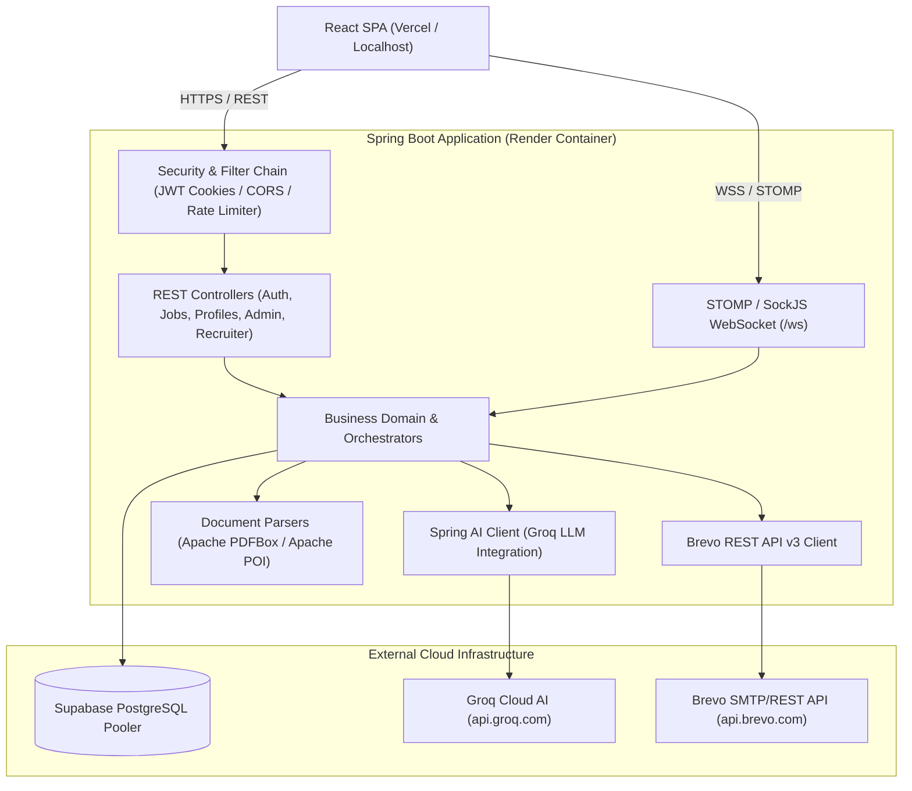

# JobPortal AI — Backend REST & WebSocket Engine

<p align="center">
  
  
  
  
  
  
</p>

---

## 📌 Overview

**JobPortal AI Backend** is an enterprise-grade, cloud-native backend service designed to power next-generation recruitment and career development. Built with **Spring Boot 4 (Spring Framework 7)** and **Java 21**, it delivers high-performance REST APIs, real-time WebSocket communication, AI-driven candidate-to-job matching, automated ATS resume parsing, and interactive mock interview evaluation.

The system is containerized with a hardened **Alpine-based multi-stage Docker build**, connected to a managed **Supabase PostgreSQL** cluster, integrated with **Groq AI (Spring AI)** for LLM inferencing, and powered by **Brevo REST API** for transactional email delivery.

---

## 🏗️ Architecture



---

## 🚀 Key Features

### 1. 🔐 Security & Identity Management
- **HttpOnly Cookie Authentication**: JWT access tokens are transported exclusively via secure, `HttpOnly` cookies (`SameSite=None`, `Secure=true` in production), preventing XSS token theft.
- **Stateless Authorization**: Role-Based Access Control (`CANDIDATE`, `RECRUITER`, `ADMIN`) enforced via Spring Security `@EnableMethodSecurity`.
- **Email OTP Verification**: 6-digit cryptographic OTP generation with time-based expiry (5 minutes) for account registration and password reset.
- **Rate Limiting**: Built-in in-memory sliding window rate limiter safeguarding authentication routes against brute-force attacks.

### 2. 🤖 AI Engines & Spring AI Integration
- **ATS Resume Analyzer**: Extracts raw text from `.pdf` (Apache PDFBox) and `.docx` (Apache POI), passes structured prompts to Groq LLM, and evaluates ATS keyword scores, strengths, weaknesses, and skill gaps. Features an autonomous heuristic fallback engine if LLM limits are reached.
- **Intelligent Job Matching**: Bidirectional semantic matching aligning candidate skill vectors with recruiter job descriptions.
- **AI Career Copilot**: Context-aware recruitment assistant answering job search queries, role requirements, and interview tips.
- **Mock Interview Simulator**: Dynamic behavioral and technical interview generation with real-time answer scoring and actionable feedback.

### 3. 💬 Real-Time Messaging & Chat
- **STOMP over SockJS**: Full-duplex WebSocket messaging at `/ws` with channel-level authentication (`CookieHandshakeInterceptor` and `JwtChannelInterceptor`).
- **Private Conversations**: Secure 1-on-1 recruiter-to-candidate chats with typing indicators, delivery receipts, and unread counters.

### 4. 🏢 Recruiter & Admin Management
- **Recruiter Verification Workflow**: Administrative review and approval pipeline for recruiter business credentials.
- **Job Lifecycle Engine**: Multi-mode job posting, facet-based filtering, view tracking, and applicant status pipelines (`APPLIED`, `SHORTLISTED`, `REJECTED`, `HIRED`).
- **Platform Analytics**: Global platform metrics, user management, and system-wide audit reports.

---

## 🛠️ Technology Stack

| Layer | Technology | Purpose |
|---|---|---|
| **Language** | Java 21 (LTS) | Modern language features, Virtual Threads, Pattern Matching |
| **Framework** | Spring Boot 4.1.0 | Core application runtime & autoconfiguration |
| **Security** | Spring Security 7.x + JJWT 0.12.7 | Cookie-based stateless JWT authentication |
| **Persistence** | Spring Data JPA + Hibernate 7.x | Object-relational mapping & repository abstractions |
| **Database** | Supabase PostgreSQL | Managed cloud relational database with connection pooling |
| **Connection Pool** | HikariCP 7.0.2 | High-performance JDBC connection pooling |
| **AI / LLM** | Spring AI 2.0.0 (OpenAI Starter) | Groq LLaMA/Mixtral model orchestration |
| **Document Processing** | Apache PDFBox 3.0.3, Apache POI 5.3.0 | PDF and DOCX text extraction |
| **Real-Time** | Spring WebSocket + STOMP + SockJS | Interactive chat and push notifications |
| **Transactional Email** | Brevo HTTPS REST API v3 | Reliable OTP and notification dispatching |
| **Object Mapping** | ModelMapper 3.2.4 + Jackson | DTO to Entity conversions |
| **Containerization** | Docker (Alpine Linux) | Lightweight, multi-stage production deployment |

---

## 📁 Repository Structure

```
JOBPORTAL_BACKEND/
├── .mvn/wrapper/                  # Maven wrapper binaries & configuration
├── src/
│   ├── main/
│   │   ├── java/com/jobportal/
│   │   │   ├── chat/             # WebSocket, STOMP interceptors, chat entities & controllers
│   │   │   ├── config/           # Security, CORS, Cookies, RateLimiter, App configs
│   │   │   ├── controller/       # REST controllers (Auth, Jobs, Profiles, Admin, Health)
│   │   │   ├── copilot/          # AI Career Copilot service & endpoints
│   │   │   ├── domain/           # Enums (Roles, Statuses, WorkModes)
│   │   │   ├── dto/              # Request and Response transfer objects
│   │   │   ├── entity/           # JPA entities (User, Job, Company, Application, etc.)
│   │   │   ├── interview/        # AI Mock Interview evaluation module
│   │   │   ├── jobmatch/         # Candidate-Job semantic matching algorithms
│   │   │   ├── recommendation/   # Feed recommendation engine
│   │   │   ├── recruiter/        # Recruiter verification & management
│   │   │   ├── repository/       # Spring Data JPA repositories
│   │   │   ├── resumeanalysis/   # ATS scoring, PDF/DOCX parsing, heuristics
│   │   │   ├── resumebuilder/    # Resume drafting & generation services
│   │   │   ├── service/          # Service interfaces
│   │   │   ├── serviceImpl/      # Service implementations
│   │   │   └── utility/          # Email helpers, file storage utilities
│   │   └── resources/
│   │       ├── application.properties        # Base application settings
│   │       ├── application-prod.properties   # Production overrides
│   │       └── application-local.properties  # Local developer overrides (gitignored)
│   └── test/java/com/jobportal/  # Unit & Integration test suite (41 tests)
├── .dockerignore                 # Excludes local artifacts from Docker context
├── Dockerfile                    # Multi-stage production container definition
├── mvnw / mvnw.cmd               # Maven wrappers for Linux/macOS and Windows
└── pom.xml                       # Maven build manifest & dependencies
```

---

## ⚙️ Environment Variables Reference

| Variable | Required | Default | Description |
|---|---|---|---|
| `PORT` | Optional | `8080` | Port on which the Spring Boot application listens (injected by Render) |
| `SPRING_PROFILES_ACTIVE` | Optional | `local` | Active profile (`prod` in cloud deployments) |
| `DATABASE_URL` | **Yes** | `jdbc:postgresql://localhost:5432/jobportal` | Supabase / PostgreSQL JDBC connection URL |
| `DATABASE_USERNAME` | **Yes** | `postgres` | Database user (e.g. `postgres.cjlkwhirwqptrdbrickj`) |
| `DATABASE_PASSWORD` | **Yes** | `12345678` | Database password |
| `JWT_SECRET` | **Yes** | *(Default dev secret)* | Base64-encoded secret key for signing JWTs (min. 64 chars) |
| `JWT_EXPIRATION_MS` | Optional | `28800000` | Token lifetime in milliseconds (8 hours) |
| `COOKIE_SECURE` | Optional | `false` | Set `true` in production to restrict cookies to HTTPS |
| `COOKIE_SAME_SITE` | Optional | `Lax` | Set `None` in production for cross-domain SPA requests |
| `FRONTEND_URL` | Optional | `http://localhost:5173,...` | Allowed CORS origins (comma-separated URLs) |
| `BREVO_API_KEY` | **Yes** | — | Brevo REST API v3 key (`xkeysib-...`) |
| `MAIL_FROM` | Optional | `namijojo5687@gmail.com` | Verified Brevo sender email address |
| `MAIL_FROM_NAME` | Optional | `JobPortal AI` | Friendly sender name for transactional emails |
| `AI_API_KEY` | **Yes** | — | Groq platform API key (`gsk_...`) |
| `AI_BASE_URL` | Optional | `https://api.groq.com/openai/v1` | Groq OpenAI-compatible API endpoint |
| `AI_MODEL` | Optional | `openai/gpt-oss-120b` | Target LLM model name |
| `FILE_UPLOAD_DIR` | Optional | `uploads` | Directory for uploaded avatars and documents |
| `ADMIN_BOOTSTRAP_ENABLED` | Optional | `true` | Automatically initializes default admin user if not present |

---

## 💻 Local Development Setup

### Prerequisites
- **Java Development Kit (JDK) 21** or later
- **Maven 3.9+** (or use the included `./mvnw`)
- **PostgreSQL 15+** running locally (or a Supabase connection)

### 1. Clone the Repository
```bash
git clone https://github.com/yashlodam/JOBPORTAL_BACKEND.git
cd JOBPORTAL_BACKEND
```

### 2. Configure Database
Create a local database named `jobportal`:
```sql
CREATE DATABASE jobportal;
```

### 3. Build the Application
```bash
# On Linux / macOS
./mvnw clean package

# On Windows
.\mvnw.cmd clean package
```

### 4. Run the Application
```bash
# On Linux / macOS
./mvnw spring-boot:run

# On Windows
.\mvnw.cmd spring-boot:run
```
The server will start on `http://localhost:8080`.

---

## 🐳 Docker Deployment

The application features an enterprise-grade multi-stage `Dockerfile`:
- **Stage 1 (`builder`)**: Uses `eclipse-temurin:21-jdk-alpine` to compile and package the fat JAR.
- **Stage 2 (`runtime`)**: Uses ultra-minimal `eclipse-temurin:21-jre-alpine` (~180MB total size).
- **Security**: Runs under an unprivileged user `appuser` (UID `10001`).
- **Graceful Shutdown**: Starts with `exec java ...` ensuring `SIGTERM` signals propagate cleanly.

### Build and Run with Docker Locally:
```bash
# Build Docker image
docker build -t jobportal-backend:latest .

# Run container with environment variables
docker run -d \
  --name jobportal-backend \
  -p 8080:8080 \
  -e SPRING_PROFILES_ACTIVE=prod \
  -e DATABASE_URL="jdbc:postgresql://<host>:5432/<db>?sslmode=require" \
  -e DATABASE_USERNAME="<user>" \
  -e DATABASE_PASSWORD="<password>" \
  -e BREVO_API_KEY="<brevo-key>" \
  -e AI_API_KEY="<groq-key>" \
  -e FRONTEND_URL="http://localhost:5173" \
  jobportal-backend:latest
```

---

## 🌐 Production Deployment on Render

This repository is optimized for one-click deployment on [Render](https://render.com) using Docker:

1. **Create a New Web Service** on Render and connect repository `yashlodam/JOBPORTAL_BACKEND`.
2. Select **Docker** environment.
3. Configure **Health Check Path**: `/health`.
4. Add the required environment variables from the [Reference Table](#-environment-variables-reference).
5. Render builds the Docker image and provisions the container at `https://<service-name>.onrender.com`.

---

## 📡 Core API Endpoints

### 🩺 Health & System
| Method | Endpoint | Access | Description |
|---|---|---|---|
| `GET` | `/` | Public | API greeting, system status, uptime, and documentation link |
| `GET` | `/health` | Public | Lightweight health check returning `{"status":"UP"}` |
| `GET` | `/actuator/health` | Public | Actuator health endpoint alias |

### 🔐 Authentication (`/api/auth`)
| Method | Endpoint | Access | Description |
|---|---|---|---|
| `POST` | `/api/auth/register` | Public | Register new candidate or recruiter |
| `POST` | `/api/auth/login` | Public | Authenticate user & set `access_token` HttpOnly cookie |
| `POST` | `/api/auth/logout` | Public | Invalidate session & clear auth cookie |
| `POST` | `/api/auth/send-otp/{email}` | Public | Generate and send 6-digit OTP via Brevo |
| `POST` | `/api/auth/verify-otp` | Public | Verify submitted OTP token |
| `POST` | `/api/auth/reset-password` | Public | Update password using verified OTP |
| `GET` | `/api/auth/me` | Authenticated | Restore active session user profile |

### 💼 Jobs & Companies (`/api/jobs`, `/api/companies`)
| Method | Endpoint | Access | Description |
|---|---|---|---|
| `GET` | `/api/jobs` | Public | Search & list jobs with pagination |
| `GET` | `/api/jobs/{id}` | Public | Detailed job posting information |
| `POST` | `/api/jobs/filter` | Public | Multi-criteria faceted job filtering |
| `GET` | `/api/companies` | Public | Paginated company profiles |
| `GET` | `/api/companies/{id}` | Public | Company profile with active vacancies |

### 📄 AI & Resumes (`/api/resume-analysis`, `/api/ai`)
| Method | Endpoint | Access | Description |
|---|---|---|---|
| `POST` | `/api/resume-analysis/upload` | Candidate | Upload and analyze PDF/DOCX resume |
| `GET` | `/api/resume-analysis/latest` | Candidate | Retrieve latest ATS scoring breakdown |
| `POST` | `/api/ai/copilot/chat` | Public / Auth | Interact with AI Career Copilot |
| `POST` | `/api/interviews/evaluate` | Candidate | Evaluate candidate answer during mock interview |

### 💬 Real-Time WebSocket (`/ws`)
| Channel / Topic | Direction | Purpose |
|---|---|---|
| `/ws` | Client → Server | SockJS connection handshake with cookie auth |
| `/app/chat.sendMessage` | Client → Server | Publish new message to active conversation |
| `/topic/conversation.{id}` | Server → Client | Broadcast real-time message to conversation participants |
| `/user/queue/notifications` | Server → Client | Push targeted personal notification alerts |

---

## 🧪 Testing

The test suite includes unit and integration tests verifying controllers, security filters, JWT channel interceptors, rate limiting, and the resume scoring engine:

```bash
# Run all 41 test cases
./mvnw test

# Run a specific test class
./mvnw test -Dtest=RateLimitingFilterTest
```

---

## 📄 License & Attribution

Developed by [Yash Lodam](https://github.com/yashlodam).  
Licensed under the **MIT License**.
